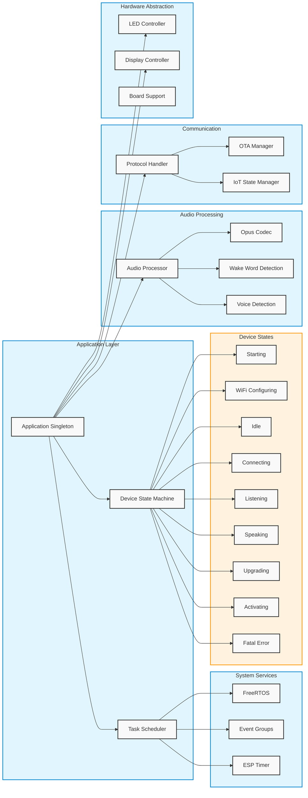

# 系统架构说明

## 1. 应用层 (Application Layer)
- **Application Singleton**: 系统的核心控制器，管理所有模块的交互
- **Device State Machine**: 管理设备状态转换
- **Task Scheduler**: 负责任务调度和管理

## 2. 音频处理 (Audio Processing)
- **Audio Processor**: 音频处理核心
- **Opus Codec**: 音频编解码
- **Wake Word Detection**: 唤醒词检测
- **Voice Detection**: 语音检测

## 3. 通信模块 (Communication)
- **Protocol Handler**: 协议处理
- **OTA Manager**: 固件更新管理
- **IoT State Manager**: IoT状态管理

## 4. 硬件抽象层 (Hardware Abstraction)
- **LED Controller**: LED控制
- **Display Controller**: 显示控制
- **Board Support**: 板级支持

## 5. 系统服务 (System Services)
- **FreeRTOS**: 实时操作系统
- **Event Groups**: 事件组管理
- **ESP Timer**: 定时器服务

## 6. 设备状态 (Device States)
- **Starting**: 启动状态
- **WiFi Configuring**: WiFi配置状态
- **Idle**: 空闲状态
- **Connecting**: 连接状态
- **Listening**: 监听状态
- **Speaking**: 说话状态
- **Upgrading**: 升级状态
- **Activating**: 激活状态
- **Fatal Error**: 错误状态 