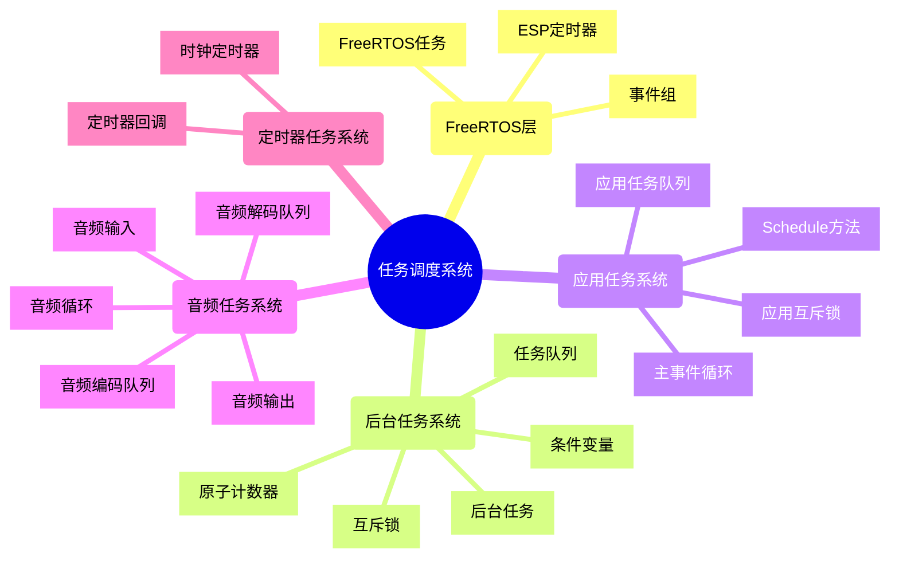

# 任务调度系统架构

## 1. FreeRTOS层
- **FreeRTOS任务**: 底层任务管理，提供任务创建、调度和同步机制
- **事件组**: 用于任务间的通信和同步
- **ESP定时器**: 提供定时器功能，用于周期性任务

## 2. 后台任务系统
- **后台任务**: 在FreeRTOS任务中运行的专用任务
- **任务队列**: 存储待执行的任务
- **互斥锁**: 保护任务队列的访问
- **条件变量**: 实现任务等待和通知机制
- **原子计数器**: 跟踪活动任务数量

## 3. 应用任务系统
- **Schedule方法**: 提供应用级别的任务调度接口
- **主事件循环**: 在单独的FreeRTOS任务中运行，处理任务队列
- **应用任务队列**: 存储待执行的应用任务
- **应用互斥锁**: 保护应用任务队列的访问

## 4. 音频任务系统
- **音频循环**: 在单独的FreeRTOS任务中运行
- **音频输入**: 处理音频输入
- **音频输出**: 处理音频输出
- **音频解码队列**: 存储待解码的音频数据
- **音频编码队列**: 存储待编码的音频数据

## 5. 定时器任务系统
- **时钟定时器**: 周期性触发回调函数
- **定时器回调**: 定时器触发时执行的回调函数

## 工作流程

1. **任务调度**:
   - 应用层通过`Schedule`方法将任务添加到应用任务队列
   - 设置事件组中的`SCHEDULE_EVENT`位，通知主事件循环
   - 主事件循环检测到事件，从队列中取出任务并执行

2. **后台任务执行**:
   - 应用层通过`BackgroundTask::Schedule`方法将任务添加到后台任务队列
   - 后台任务检测到队列非空，取出任务并执行
   - 任务执行完成后，减少活动任务计数

3. **音频处理**:
   - 音频循环定期调用`OnAudioInput`和`OnAudioOutput`方法
   - 音频输入处理将数据添加到编码队列，并通过后台任务进行编码
   - 音频输出处理从解码队列取出数据，并通过后台任务进行解码

4. **定时器任务**:
   - 时钟定时器以固定间隔触发回调函数
   - 回调函数执行定时任务，如更新UI、检查网络状态等 